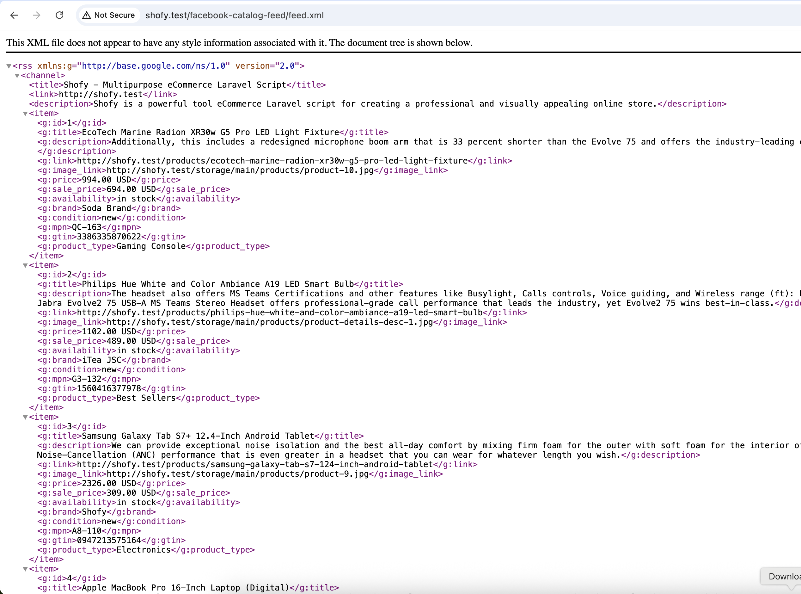

# Facebook Catalog Feed Plugin for Botble CMS

This plugin generates Facebook Catalog Feed XML for your e-commerce products, compatible with Facebook Commerce Manager and other platforms that support Google Shopping feed format.

This plugin is developed and maintained by [FriendsOfBotble](https://github.com/FriendsOfBotble).

## Features

- Generate XML product feed in Facebook/Google Shopping format
- Support for multiple feed types (all products, new, featured, on sale)
- Include/exclude out of stock products
- Support for product variations as separate items
- Configurable product conditions and availability status
- Admin dashboard widget for easy feed URL access
- Automatic category path generation
- Support for product images, prices, and sale prices

## Installation

1. Download the plugin
2. Extract to `platform/plugins/fob-facebook-catalog-feed`
3. Go to Admin Panel → Plugins → Activate the plugin
4. Navigate to E-commerce → Facebook Catalog Feed to configure settings

## Configuration

Navigate to **Admin Panel → E-commerce → Facebook Catalog Feed** to access the settings page.

### Settings Page Overview

The settings page is organized into several sections for easy configuration:

#### 1. General Settings
- **Enable/Disable**: Toggle the feed generation on/off. When disabled, the feed URL will return a 404 error.

#### 2. Product Selection
- **Include out of stock products**: Choose whether to include products with zero stock in the feed
- **Include variations**: List product variations as separate feed items. When enabled, each variation (size, color, etc.) appears as a separate item

#### 3. Product Attributes
- **Default brand**: Fallback brand name when products don't have a brand assigned (e.g., "Your Store Name")
- **Product condition**: Default condition for all products (new, refurbished, or used)

#### 4. Availability Settings
- **In-stock availability text**: Choose from "in stock", "available for order", or "preorder"
- **Out-of-stock availability text**: Choose from "out of stock" or "discontinued"

### Settings Page Features

The settings page includes:
- **Feed URL Display**: Easy access to copy your main feed URL
- **Feed Type Examples**: Quick reference for different feed types (all, new, featured, on sale)
- **Quick Setup Guide**: Step-by-step instructions for Facebook Commerce Manager integration
- **Copy to Clipboard**: One-click copying of feed URLs

## Feed URLs

- All products: `https://yoursite.com/facebook-catalog-feed/feed.xml`
- New products: `https://yoursite.com/facebook-catalog-feed/feed.xml?type=new`
- Featured products: `https://yoursite.com/facebook-catalog-feed/feed.xml?type=featured`
- On sale products: `https://yoursite.com/facebook-catalog-feed/feed.xml?type=on_sale`

## 🔸 Scheduled Feed URL

Best for automation (e.g., syncing from your site).

1. Host your product feed on your website (e.g., `https://yoursite.com/facebook-catalog-feed/feed.xml`)

2. In Commerce Manager, go to **Data Sources** > **Data Feeds** > **Add Data Feed**

3. Choose **Scheduled Feed**, enter the URL and set frequency (daily is recommended)

## Feed Format

The feed follows the Google Shopping/Facebook Catalog XML format with these fields:

- `g:id`: Product ID
- `g:title`: Product name
- `g:description`: Product description
- `g:link`: Product URL
- `g:image_link`: Main product image
- `g:additional_image_link`: Additional images
- `g:availability`: Stock status
- `g:price`: Product price
- `g:sale_price`: Sale price (if applicable)
- `g:brand`: Brand name
- `g:condition`: Product condition
- `g:mpn`: SKU
- `g:gtin`: Barcode
- `g:google_product_category`: Category hierarchy
- `g:product_type`: Product type
- `g:shipping_weight`: Product weight

## Requirements

- Botble CMS 7.0+
- E-commerce plugin activated
- PHP 8.0+

## License

The MIT License (MIT)