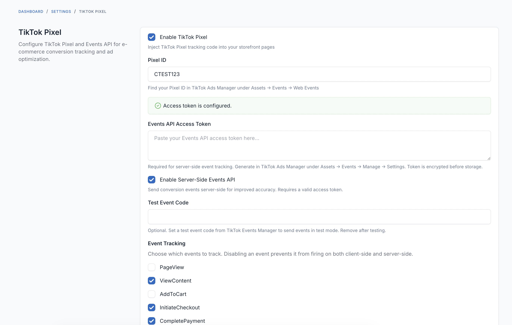
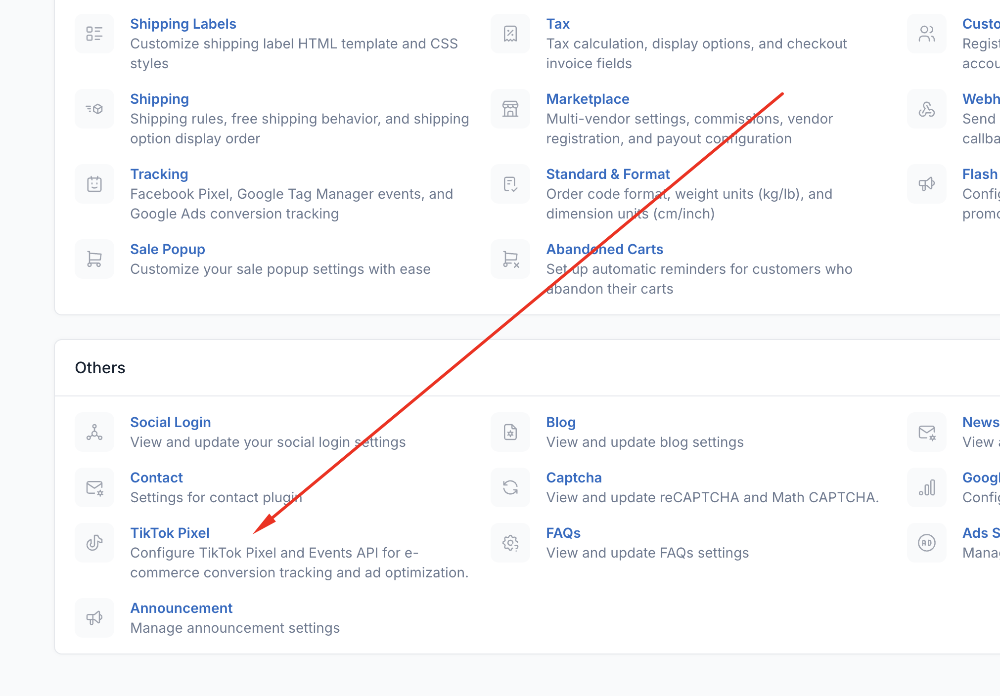

# FOB TikTok Pixel

TikTok Pixel integration with Server-Side Events API for Botble CMS e-commerce stores. Tracks conversions and optimizes ad campaigns with both client-side pixel and server-side event deduplication.

## Features

- **TikTok Pixel JavaScript** - Async pixel injection via `<head>`, zero performance impact
- **E-commerce Event Tracking** - PageView, ViewContent, AddToCart, InitiateCheckout, CompletePayment, Search, Contact
- **Server-Side Events API** - Reliable server-to-server tracking with event deduplication
- **Enhanced Matching** - SHA256 hashed email, phone, external_id for better attribution
- **Encrypted Access Token** - Token stored securely with Laravel Crypt
- **Per-Event Toggles** - Enable/disable individual events from admin panel

## Requirements

- Botble CMS 7.5+
- PHP 8.2+
- TikTok Ads Manager account with Pixel created
- Access Token (for Events API)

## Installation

1. Copy plugin to `platform/plugins/fob-tiktok-pixel/`
2. Run: `php artisan cms:plugin:activate fob-tiktok-pixel`

## TikTok Setup

1. Go to [TikTok Ads Manager](https://ads.tiktok.com)
2. Navigate to **Assets → Events → Web Events**
3. Create a TikTok Pixel (select "Manually Install Pixel Code")
4. Copy the **Pixel ID** (starts with `C`)
5. For Events API: Generate an **Access Token** in Events API settings

## Configuration

Navigate to **Admin → Settings → Others → TikTok Pixel**.

1. Enable the plugin
2. Enter your Pixel ID
3. (Optional) Paste Access Token and enable Events API
4. Configure which events to track
5. Click Save
6. Test connection (if Events API enabled)

## Events Tracked

| Event | Trigger | Server-Side |
|-------|---------|:-----------:|
| PageView | Every page load | - |
| ViewContent | Product page viewed | ✓ |
| AddToCart | Product added to cart | - |
| InitiateCheckout | Checkout page loaded | - |
| CompletePayment | Order placed | ✓ |
| Search | Search results page | - |
| Contact | Contact form submitted | - |

## Server-Side Events API

Server-side events provide more reliable tracking unaffected by ad blockers. Events are deduplicated using shared `event_id` between client and server.

**Requirements for Events API:**
- Plugin enabled with Pixel ID
- Events API toggle enabled
- Valid Access Token configured

**Test Event Code:** Use the test event code field during development to verify events in TikTok Events Manager without affecting production data.

## Troubleshooting

**Events not showing in TikTok**
- Verify Pixel ID is correct (starts with `C`)
- Check browser console for pixel loading errors
- Allow 15-20 minutes for events to appear in Events Manager

**Events API connection failed**
- Verify Access Token is valid and not expired
- Ensure Pixel ID matches the token's pixel

**Duplicate events**
- The plugin automatically deduplicates between client and server using `event_id`
- If seeing duplicates, verify both client and server are sending the same `event_id`

## License

MIT
